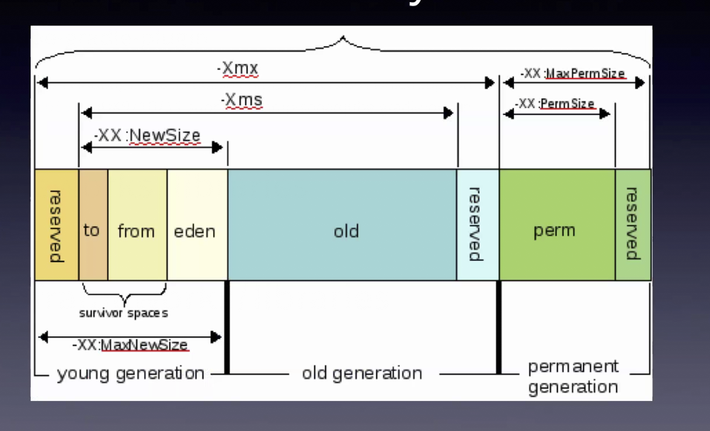
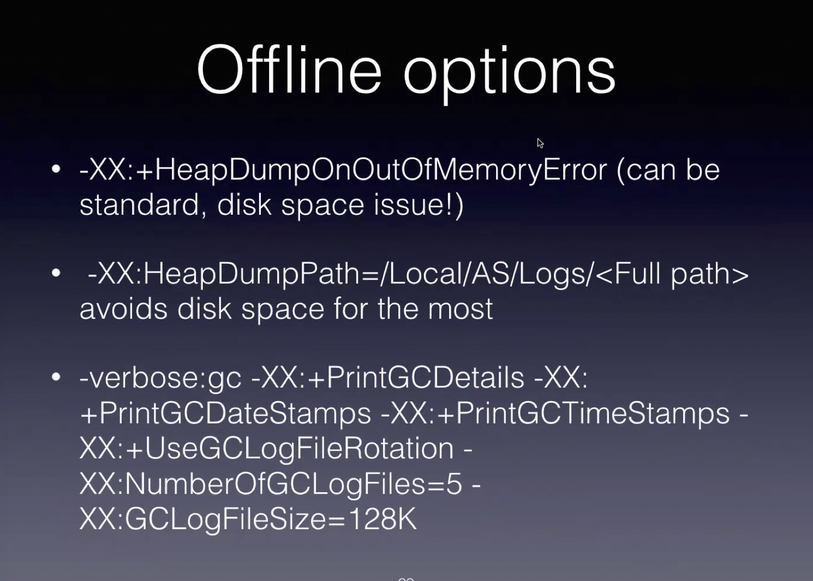
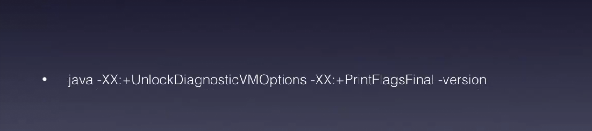

# Java 9

## Modules Videos

1. [A simple introduction to the new Module System ](https://www.youtube.com/watch?v=MGX-JfMl9-Y)

2. [Introduction to Java Modules](https://www.youtube.com/watch?v=2Hmrn_r-uJA)

3. [Advanced Modular Development](https://www.youtube.com/watch?v=WWbw8u5jaaU)

4. [Modules and Services](https://www.youtube.com/watch?v=u8Hbdo-u-88)

5. [Jigsaw under the hood](https://www.youtube.com/watch?v=Vxfd3ehdAZc)

6. [Migrating app to modules](https://youtu.be/M7q3C8OwJe8)


## Other Java9 features

7. [Java 9 features](https://www.youtube.com/watch?v=0RegttLUXeU)
See the jshell.txt log

8. [Java 9 enhancement to Optional](https://aboullaite.me/java-9-enhancements-optional-stream)

## `Module` class

There is also a new `Module` class, and modules can be introspected, just like classes do:

    java.lang.Module
    class.getModule()

There are 26 base modules; guaranteed to have **No Cycles** (and creating modules that have cycles *will* cause compile errors).

`java.base` is always there (implicitly `required`).

The actual JDK has 75 modules (most of the other are in the `jdk.` namespace).

JDK modules are packaged as `jmod` files, which contain more stuff than JAR files (such as native code, DLLs, etc.)

## JLink

To package a subset of modules, to make a more compact image (e.g., to use in Docker images):

    $ jlink --module-path ${JAVA_HOME}/jmods --output jre --add-modules java.base

will create a package that is 43MB in size (as opposed to the 340MB+ for the full JDK image).

You can package your own application and even create a launcher, while also compressing and making it even smaller:

    $ jlink --module-path lib:${JAVA_HOME}/jmods \
        --output my-app \
        --add-modules org.openjdk.hello \
        --strip-debug \
        --compress 2 \
        --launcher hello=org.openjdk.hello

(see below for how to build the `hello` module).

# Simple example

See the `java9` project and the `jj` script for details.

## Create a separate module and "import" it

The library module:

    module org.openjdk.text {
        export org.openjdk.text;
    }

imported by the application module:

    module org.openjdk.hello {
        requires org.openjkd.text;
    }

### Describe the module

    $ jar --file lib/org-openjdk-hello.jar --describe-module

# Running multiple JDKs

## Running both JDK 8 and 9 on Ubuntu

Following [this guide](http://www.webupd8.org/2015/02/install-oracle-java-9-in-ubuntu-linux.html):

    $ sudo add-apt-repository ppa:webupd8team/java

    $ sudo apt-get update && sudo apt-get upgrade -y

    $ update-java-alternatives --list
    java-8-oracle                  1081       /usr/lib/jvm/java-8-oracle
    java-9-oracle                  1091       /usr/lib/jvm/java-9-oracle

    $ java -version
    java version "1.8.0_151"
    Java(TM) SE Runtime Environment (build 1.8.0_151-b12)
    Java HotSpot(TM) 64-Bit Server VM (build 25.151-b12, mixed mode)


To [switch between versions](https://askubuntu.com/questions/740757/switch-between-multiple-java-versions):

    $ sudo update-alternatives --config java

### Manually setting `java`

Use the `update-alternatives` command (see `sudo update-alternatives --help`):

    $ which java
    /usr/bin/java

    $ java -version
    java version "9.0.1"
    Java(TM) SE Runtime Environment (build 9.0.1+11)
    Java HotSpot(TM) 64-Bit Server VM (build 9.0.1+11, mixed mode)

    $ sudo update-alternatives --list java
    /usr/lib/jvm/java-8-oracle/jre/bin/java
    /usr/lib/jvm/java-9-oracle/bin/java

    $ sudo update-alternatives --set java /usr/lib/jvm/java-8-oracle/jre/bin/java
    update-alternatives: using /usr/lib/jvm/java-8-oracle/jre/bin/java to provide /usr/bin/java (java) in manual mode

    $ java -version
    java version "1.8.0_151"
    Java(TM) SE Runtime Environment (build 1.8.0_151-b12)
    Java HotSpot(TM) 64-Bit Server VM (build 25.151-b12, mixed mode)

## Running OpenJDK 10 on MacOS

Download from [here](http://jdk.java.net/10/)

Install it here:

    /Library/Java/JavaVirtualMachines

Script (note the weird directory structure - this may cause failures)

    VERSION=10.0.2
    DOWNLOAD_URL=“download.java.net/java/GA/jdk10”
    JDK=“openjdk-${VERSION}_osx-x64_bin.tar.gz”
    INSTALL_DIR=“/Library/Java/JavaVirtualMachines“

    wget https://${DOWNLOAD_URL}/${VERSION}/19aef61b38124481863b1413dce1855f/13/${JDK} -O /tmp/${JDK}
    sudo tar xfz /tmp/${JDK} -C ${INSTALL_DIR}


Useful tools:

    /usr/libexec/java_home -V
    /usr/libexec/java_home -v ${version}

### Java aliases
    alias javals='/usr/libexec/java_home -V 2>&1 | grep -E "\d.\d.\d(_\d\d)?" | cut -d , -f 1 | colrm 1 4 | grep -v Home'
    alias j8='export JAVA_HOME=$(jhome 1.8)'
    alias j9='export JAVA_HOME=$(jhome 9)'
    alias j10='export JAVA_HOME=$(jhome 10)'

### Locating the JAVA_HOME for a specific version.

    function jhome {
        local version=${1:-}
        if [[ -n ${version} ]]
        then
            java_home=$(/usr/libexec/java_home -v ${version})
            if [[ $? == 0 ]]
            then
                echo ${java_home}
                return 0
            fi
            return 1
        fi
        echo $(/usr/libexec/java_home)
    }

[GitHub Gist](https://gist.github.com/massenz/faff155523a50313be6f25a5b631a63d)

[Migrating to OpenJDK 11](https://medium.com/criciumadev/its-time-migrating-to-java-11-5eb3868354f9)

Areas to look into:
- Lombok
- PowerMock
- Jacoco

## JVM Tuning Flags

### Understand the Memory Model



### Memory tuning options


    -XX:+UseG1GC   optimal for user-facing processes
    -XX:+UseConcMarkSweepGC

String de-dup improves size of heap up to 10%
Hotspot compiler runs for 15,000 iterations (default, tunable) to optimize code


### Tools:


- TODO: learn moer about `runq` (and `sar`)
- `jinfo`
- `jstat  -gcutil` (but not very useful for G1GC)

look for GCT (GC time) and YGTC v. total time (first col `timestamp`) and figure out ratio (% time spent GC) should < 1%

`-Xmx`  is the important tuning for OOM
“as small as possible, as big as necessary”



In most cases, using “defaults” is usually a bad situation
(see slide for printing out the defaults)




# Migrating apps to Modules

Libraries imported (and not modularized) will be listed as their JAR filenames:

    module my.module {
        requires jackson.core;          // Will use the jackson-core-x.x.x.jar JAR
        requires jackson.databind;
        requires java.sql;              // A JDK 9 module
    }

to compile and inspect:

    $ javac -d mods --module-path lib --module-source-path src -m org.tweetsum
    $ javap mods/org.tweetsum/module-info.class

If our code needs to "expose" some classes for "deep reflection," we cannot simply `export` the package, we need to `open` it:

    module org.tweetsum {
        requires jackson.databind;
        ...
        // The `to` qualifier may be omitted.
        opens org.tweetsum to jackson.databind;
    }

To get started migrating an app/library, use `jdeps` to generate an initial iteration of the `module-info.java` file:

    $ jdeps --generate-module-info src \
        lib/jackson-core-2.6.6.java

will write out `src/jackson.core/module-info.java`.

---
# Appendix - `jshell` notes

```

// Immutable collections.
List<String> strings = List.of("a", "b", "c");
strings.stream().filter(s -> s.startsWith("a")).collect(Collectors.toList())

// Completable futures for async programming.
CompletableFuture<String> cf = new CompletableFuture<String>();
CompletableFuture<String> copy = cf.copy();
cf.complete("done")
copy.get()

// Java Stack processing.
StackWalker.getInstance().walk(s -> s.map(f -> f.getMethodName()).collect(Collectors.toList()))

// System processes.
ProcessBuilder proc = new ProcessBuilder();
Process p = proc.command(List.of("ls", "-laH", "/tmp")).start();
String s = new String( p.getInputStream().readAllBytes());
System.out.println(s)

ProcessHandle.current().info().commandLine()
ProcessHandle.current().info().arguments().get()

ProcessHandle.current().pid()

ProcessHandle.allProcesses().filter(p -> p.info().user().get().equals("marco")).map(p -> p.info().command()).forEach(oc -> oc.ifPresent(System.out::println))

new ProcessBuilder().command("sleep", "3").start().toHandle().onExit().thenAccept(System.out::println)

// HTTP 2 Client
HttpClient client = HttpClient().newHttpClient()
HttpRequest request = HttpRequest.newBuilder().uri(new URI("http://localhost:8080")).GET().build()

HttpResponse reponse = client.send(request, BodyHandler.asString())
response.statusCode()
response.body()

CompletableFuture<HttpResponse<String>> response = client.sendAsync(request, BodyHandler.asString())
response.get().body()
```
